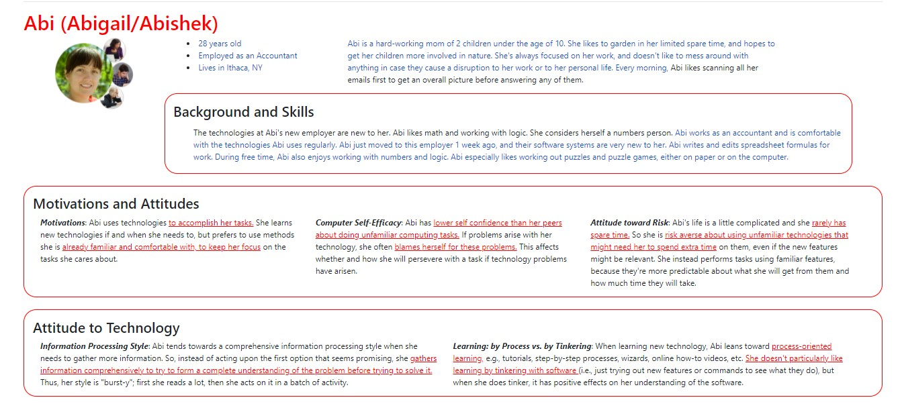
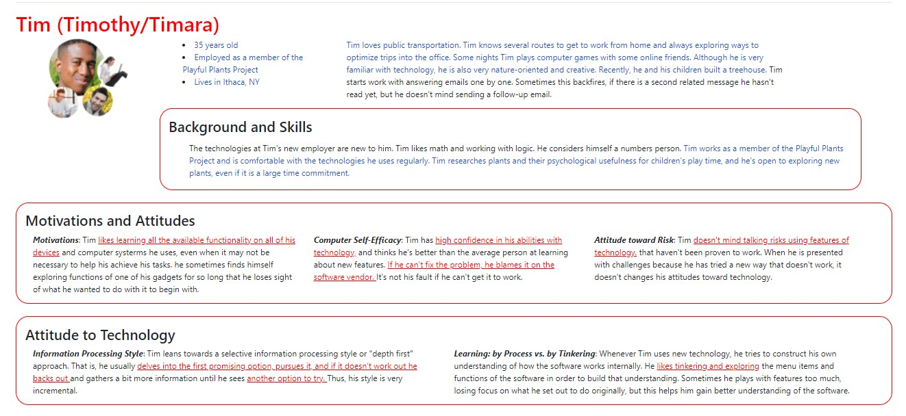
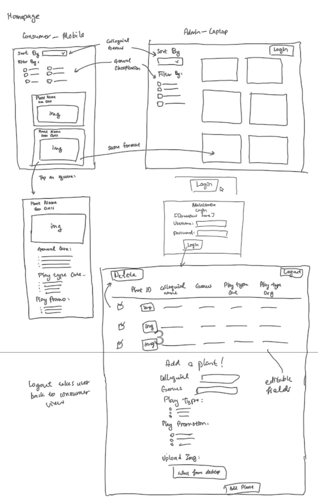
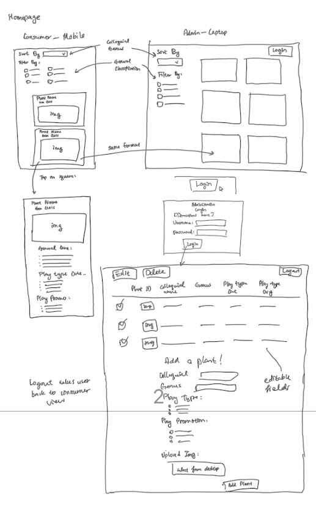
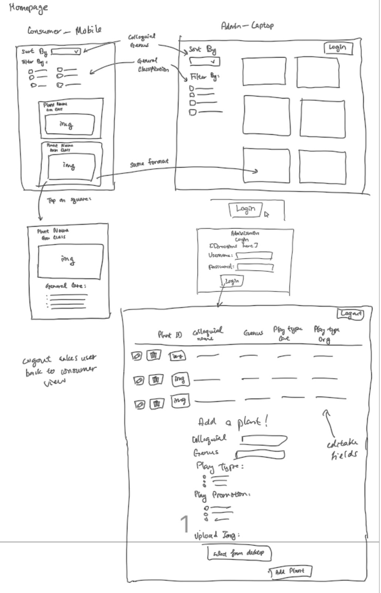
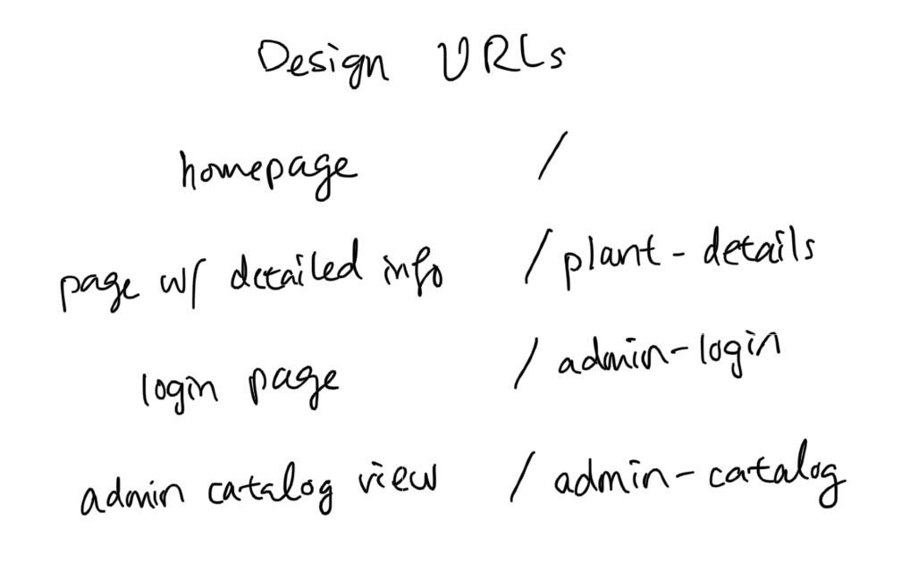

# Project 2: Design Journey

**For each milestone, complete only the sections that are labeled with that milestone.** Refine all sections before the final submission. If you later need to update your plan, **do not delete the original plan, leave it place and append your new plan below the original.** Explain why you are changing your plan. Remember you are graded on your design process. Updating the plan documents your process!

**Replace ALL _TODOs_ with your work.** (There should be no TODOs in the final submission.)

Be clear and concise in your writing. Bullets points are encouraged.

**Everything, including images, must be visible in Markdown Preview.** If it's not visible in Markdown Preview, then we won't grade it. We won't give you partial credit either. **Your design journey should be easy to read for the grader; in Markdown Preview the question _and_ answer should have a blank line between them.**


## Design / Plan (Milestone 1)

**Make the case for your decisions using concepts from class, as well as other design principles, theories, examples, and cases from outside of class (includes the design prerequisite for this course).**

You can use bullet points and lists, or full paragraphs, or a combo, whichever is appropriate. The writing should be solid draft quality.

### Audiences (Milestone 1)

> Who are your site's audiences?
> Briefly explain who the intended audiences are for your project website.
> **DO NOT INVENT RANDOM AUDIENCES HERE!** Use the audiences from the requirements.

_Consumer_: Consumers are parents with developing children.  They are interested in providing nature-rich places around their homes and pick plants that will engage their children in gardening projects or provide year-round interest.

_Site Administrator_: Members of the Playful Plants Project.  They are researchers at Cornell University


### _Consumer_ Audience Goals (Milestone 1)

> Document your audience's goals.
> List each goal below. There is no specific number of goals required for this, but you need enough to do the job.
> **DO NOT INVENT RANDOM GOALS HERE OR STEREOTYPE HERE!** Your goals are things that your users want accomplish when using the site (e.g. print a list of plants). These are informed by the Playful Plants objectives. Review the assignment's requirements for details.

_Consumer_ Goal 1: Print a list of plants for reference when gardening.

- **Design Ideas and Choices** _How will you meet those goals in your design?_
  - I will make the site printable using the @media print query.  Then, I'll reorganize content so that the list of plants is only printed out and nothing else.
- **Rationale & Additional Notes** _Justify your decisions; additional notes._
  - I think this is best because one of the interests of the parents is to help engage children in gardening projects.  If the parents are able to print a list of plants without having to get their device dirty, that would be beneficial for them.

_Consumer_ Goal 2: To be able to filter specific plants.

- I will make the site display some images and some information (such as the types of play supported) when the parents view the initial plant.
- I think this is beneficial because from the objectives, parents want to be able to tailor their selections.  If the parent is able to sort and filter specific plants to their liking, it will be nice to view them in a way they can understand the information.

_Consumer_ Goal 3: To be able to view additional details.

- The parents should be able to tap/click into a plant's name so that they can see more details.  It's a bit too much to throw a lot of information if they are initially viewing it, so letting them click into each plant so that they can view additional details will help them understand information about each plant in a more organized way.


### _Consumer_ Persona (Milestone 1)

> Use the goals you identified above to develop a persona of your site's audience.
> Create your persona using GenderMag's customizable personas.
> Take a screenshot and include it here. Persona must be visible in Markdown Preview; do not use PDF format!




### _Administrator_ Audience Goals (Milestone 1)

> Document your audience's goals.
> List each goal below. There is no specific number of goals required for this, but you need enough to do the job.
> **DO NOT INVENT RANDOM GOALS HERE OR STEREOTYPE HERE!** Your goals are things that your users want accomplish when using the site (e.g. print a list of plants). These are informed by the Playful Plants objectives. Review the assignment's requirements for details.

_Administrator_ Goal 1: Update the catalog consistently with login/logout features.

- **Design Ideas and Choices** _How will you meet those goals in your design?_
  - I will have a form that allows the administrator to add a plant to the catalog when they log in to the site.  In the form, I plan to allow a file upload so they can add a picture of the plant to the catalog. I will also have a feature to log in/out.
- **Rationale & Additional Notes** _Justify your decisions; additional notes._
  - A form is the most usable way to add a plant to the catalog because it allows the administrator to just input information into some fields when needed.  Therefore, the member of the Playful Plants Project would have an efficient time adding the plant.  I think the login/logout site separates the consumer from the administrator, so I plan on displaying the administrative view when the admins log in.

_Administrator_ Goal 2: Categorize plants according to play type.

- I will display the catalog such that it tags each plant with their respective play types.
- This is useful because while the audience will not be able to see it in the initial catalog design, it will help organize the plants so that they can see the full details of the plants.


### _Administrator_ Persona (Milestone 1)

> Use the goals you identified above to develop a persona of your site's audience.
> Create your persona using GenderMag's customizable personas.
> Take a screenshot and include it here. Persona must be visible in Markdown Preview; do not use PDF format!




### Site Design (Milestone 1)

> Document your _entire_ design process. **We want to see iteration!**
> **Show us the evolution of your design from your first idea (sketch) to the final design you plan to implement (sketch).**
> **Show us how you decided what data to display to each audience.**
> **Plan your URLs for the site.**
> **Provide a brief explanation _underneath_ each design artifact (2-3 sentences).** Explain what the artifact is, how it meets the goals of your personas (**refer to your personas by name**).
>
> **Important!** Plan _all_ site requirements. Don't forget login and logout.

_Initial Designs / Design Iterations:_





_Final Design:_



Additionally, I plan to design an "edit" page for the plant records that need to be edited.



To the editing plants page: /edit-plants


### Design Pattern Explanation/Reflection (Milestone 1)

> Write a one paragraph (6-8 sentences) reflection explaining how you used design patterns for media catalogs in your site's final design.

I used many features to make my site as usable for both audiences as possible.  I designed buttons to login/out for administrators, specifically stating that it was for administrators.  I also designed the catalog so that it doesn't overload the user with too much information at first glance.  It has a neat layout and can be sorted and filtered with, just like in Project 2.  In the additional information page for the consumer, I was originally thinking of adding in what type of play the plant supports, but I eventually decided against it because it was information the user probably didn't need on a daily basis.


### Cognitive Styles Explanation/Reflection (Milestone 1)

> Write a one paragraph (6-8 sentences) reflection explaining how your final design supports the cognitive styles of each persona.

_Consumer Cognitive Styles Reflection:_

I used the personas to a very great extent.  Firstly, based off my consumer persona, Abi was a parent, so I decided to tailor the consumer design so that she would be familiar with the layout and format of things.  Using a tile-like format, she would have a visually appealing layout that she can easily figure out how to use.  I decided to make the tile design quite simple because I didn't want to throw a bunch of information at her face, I wanted it to be as if she were scrolling through products on a media site like Amazon.  If she's had familiar experiences, she would definitely be able to use the site based off of my designs.


_Site Administrator Cognitive Styles Reflection:_

For Tim the administrator, I sort of made the design more ambiguous because TIm is familiar with technology and like playing around with things to get used to it.  By adding icons next to each plant, he would be inclined to understand what it means to edit (pencil icon) or delete (trash icon).  I also decided to put a login button on the upper right (inspired by INFO 2040 blog post site) so that Tim can see where to login.  Once he clicks the login button, I decidded to have a catalog displayed as in project two, with a few columns changed to accommodate the things we wanted to add to Project 3 (e.g. file upload, editable catalog, etc.).


## Implementation Plan (Milestone 1, Milestone 2, Milestone 3, Final Submission)

### Database Schema (Milestone 1)

> Describe the structure of your database. You may use words or a picture. A bulleted list is probably the simplest way to do this. Make sure you include constraints for each field.
> **Hint: You probably need a table for "entries", `tags`, `"entry"_tags`** (stores relationship between entries and tags), and a `users` tables.
> **Hint: For foreign keys, use the singular name of the table + _id.** For example: `image_id` and `tag_id` for the `image_tags` (tags for each image) table.

Table: entries

- id: INTEGER {PK, U, NN, AI},
- colloquial: TEXT {U, NN},
- genus: TEXT {U, NN},
- plant_id: TEXT {U, NN},
- file_ext: TEXT {NN},
- perennial: INTEGER {NN},
- annual: INTEGER {NN},
- full_sun: INTEGER {NN},
- partial_shade: INTEGER {NN},
- full_shade: INTEGER {NN},
- class: INTEGER {NN}


Table: entries_tags

- id: INTEGER {PK, U, NN, AI}
- entry_id: INTEGER {NN},
- tag_id: INTEGER {NN}


Table: tags

- id: INTEGER {PK, U, NN, AI},
- tag_name: TEXT {NN}

Table: users

- id: INTEGER {PK, U, NN, AI},
- username: TEXT {U, NN},
- password_str: TEXT {NN}


### Database Query Plan (Milestone 1, Milestone 2, Milestone 3, Final Submission)

> Plan _all_ of your database queries. You may use natural language, pseudocode, or SQL.

```
In init.sql:
// create entries database
CREATE TABLE entries (
  // put all fields from entries database schema here
)

// insert all existing records for entries
INSERT INTO entries (// all fields) VALUES (// all values)

// create tags database
CREATE TABLE tags (
  // put all fields from tags database schema here
)

// insert all existing records for tags
INSERT INTO tags (// all fields) VALUES (// all values)

// create users database
CREATE TABLE users (
  // put all fields from users database schema here
)

// insert all existing records for users
INSERT INTO users (// all fields) VALUES (// all values)
```

```
// add plant into database in catalog.php:
INSERT INTO entries (// all fields) VALUES (get from add plant form in admin view)
```

// getting record from individual tables:
// example: get all records from entries table
$result_entries = exec_sql_query($db, 'SELECT * FROM entries;');
$records_entries = $result_entries->fetchAll();


### Code Planning (Milestone 1, Milestone 2, Milestone 3, Final Submission)

> Plan any PHP code you'll need here using pseudocode.
> Tip: Break this up by pages. It makes it easier to plan.

```
In home.php: be able to sort entries and filter entries
// create sql query parts
// create bool values to see if checkboxes are checked
// create sticky values
// make an filter_by array
// if filter by has checkbox buttons checked, then add that to array
// if more than 0 things are in array, write where clause of sql query that filters records by those fields
// use join clause to get all elements in table -> fetch it

// if sort by has radio button checked then write order by clause of sql query to sort by alphabetical order

// build http query when going to details page: use a href and the http_build_query function and create an array inside with all fields needed
// querying database to place entries into cards and catalogs will be similar to project 2 - use a for loop and conditional statements
```

```
In catalog.php, use much of the same as home.php in terms of creating the table
// use join clause to get all tags of a plant in table -> fetch it, then print it in the form of a list
// add plant form
  // implement by referencing project 2 code
  // tags vs entries - make two insert queries; 1 for entries and 1 for tags
    // use lastInsert('id) to get the entries.id of the most recent record inserted
  // uploading images - if image is not uploaded, set file name and extension to 0.jpg; else upload the image and make a path to it
```

TODO: ...


### Accessibility Audit (Final Submission)

> Tell us what issues you discovered during your accessibility audit.
> What do you do to improve the accessibility of your site?

TODO


## Reflection (Final Submission)

### Audience (Final Submission)

> Tell us how your final site meets the goals of your audiences. Be specific here. Tell us how you tailored your design, content, etc. to make your website usable for your personas.

TODO


### Additional Design Justifications (Final Submission)

> If you feel like you haven’t fully explained your design choices in the final submission, or you want to explain some functions in your site (e.g., if you feel like you make a special design choice which might not meet the final requirement), you can use the additional design justifications to justify your design choices. Remember, this is place for you to justify your design choices which you haven’t covered in the design journey. You don’t need to fill out this section if you think all design choices have been well explained in the design journey.

TODO


### Self-Reflection (Final Submission)

> Reflect on what you learned during this assignment. How have you improved from Project 2? What would you do differently next time?

TODO


> Take some time here to reflect on how much you've learned since you started this class. It's often easy to ignore our own progress. Take a moment and think about your accomplishments in this class. Hopefully you'll recognize that you've accomplished a lot and that you should be very proud of those accomplishments!

TODO


### Grading: Step-by-Step Instructions (Final Submission)

> Write step-by-step instructions for the graders.
> The project if very hard to grade if we don't understand how your site works.
> For example, you must login before you can delete.
> For each set of instructions, assume the grader is starting from /

_View all entries:_

1. TODO

2.

_View all entries for a tag:_

1. TODO

2.

_View a single entry's details:_

1. TODO

2.

_How to insert and upload a new entry:_

1. TODO

2.

_How to delete an entry:_

1. TODO

2.

_How to edit and existing entry and its tags:_

1. TODO

2.
